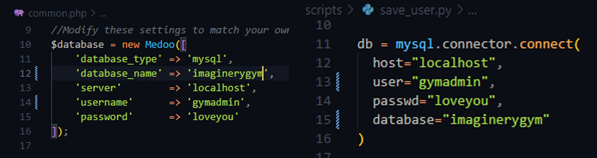

# Imaginery Gym Check-in System Website

Gym attendance system web frontend used for demo in RMIT class course [COSC2500](https://rmit.instructure.com/courses/113615).

> Intended to run on a Raspberry Pi with RFID RC522 and a 16x2 LCD
> Display connected.

***Group Information:*** *Group A2 MbP 4*

Members:
- Nguyen Dang Duy Khang ([Github](https://github.com/Khang5687))
- Truong Loc Thien
- Phung Hoang Long
- Truong Chan Hoang
- Kang Hyeonseok

## Initial Setup
> ⚠️ THIS IS REQUIRED IN ORDER TO MAKE THE WEB WORK

On the Raspberry Pi (Tested on Raspberry Pi 3). Install packages dependencies:
```
sudo apt-get update
sudo apt-get upgrade
sudo apt-get install build-essential git python3-dev python3-pip python3-smbus mysql-server 
```
 
Clone this repository and install dependencies.
```
git clone https://github.com/Khang5687/gym-check-in-system-frontend.git
cd gym-check-in-system-frontend
python3 -m pip install -r requirements.txt
```
This project uses MySQL, initialize a MySQL server if you haven't, then follow the instructions:
```
sudo mysql_secure_installation
```
Run `sudo mysql -u root -p`. Enter your password to access MySQL monitor.

Create a user in your database (change the username and password to your liking, or stick with the default):
```
-- In MySQL monitor
-- Create database 
CREATE DATABASE imaginery_gym;

-- Create admin user for the newly created database
-- Change 'loveyou' to another password if need to
CREATE USER 'gymadmin'@'localhost' IDENTIFIED BY 'loveyou';

-- Grant the 'gymadmin' user the permissions to manage 'imaginerygym' database
GRANT ALL PRIVILEGES ON imaginery_gym.* TO 'gymadmin'@'localhost';
``` 
After the database and an admin user have been created, create tables with the query in [create_tables.sql](https://github.com/Khang5687/gym-check-in-system-frontend/blob/master/create_tables.sql) by either run `mysql -u root -p imaginery_gym < create_tables.sql` in the terminal or copy and paste the queries inside MySQL monitor.

If you had made changes like the default username, database name or password. Please change it accordingly in the beginning of these 2 files: `common.php` and `save_user.py`, see the image below:

## Further configuration
Please set-up NGINX on the Raspberry Pi and allows PHP to be loaded. This is a comprehensive guide on how to do so: [NGINX Setup for Raspberry Pi](https://pimylifeup.com/raspberry-pi-nginx/)

Rename the repository to something that is easier to remember like `attendance` and move the content of the repository to `/var/www/html/`:
```
cd ..
mv gym-check-in-system-frontend attendance
sudo mv attendance /var/www/html/
```
If NGINX and MySQL database were properly configured on your Raspberry Pi and then the website should display normally in `http://your-raspberry-pi-ip-address/attendance/`

## How to use

>  ⚠️ Please make sure that you have connected the wires correctly

To add a member to the gym with an RFID Card, run `python3 /var/www/html/attendance/scripts/save_user.py`. Tap the card on the `RFID RC522` and follow instructions.
If a member is successfully added, he should appears in the "Members" section of the website dashboard.

To record their attendance, run `python3 /var/www/html/attendance/scripts/record_attendance.py`. Whenever an existing member taps the card, his attendance will be recorded and can be viewed in the "Attendance" section of the website dashboard.

**TIPS:**
It is easier to "alias" a custom command to run those python scripts without having to type the full path by modifying `~/.bashrc` file.
Open the `~/.bashrc` file:
```
nano ~/.bashrc
```
Append these two lines at the end of the file:
```
alias addmember="python3 /var/www/html/attendance/scripts/save_user.py" 
alias record="python3 /var/www/html/attendance/scripts/record_attendance.py"
```
Then source the `~/.bashrc` file to make changes:
```
source ~/.bashrc
```
After that, we can use the command `addmember` and `record` to run the two relevant python scripts. This is how we were able to avoid the hassle of typing the full path of the python scripts in the presentation.

## Note
Due to technical errors, I cannot fully implement the "Register Member" feature on the website. Therefore, please expect bugs when experiment with it.
